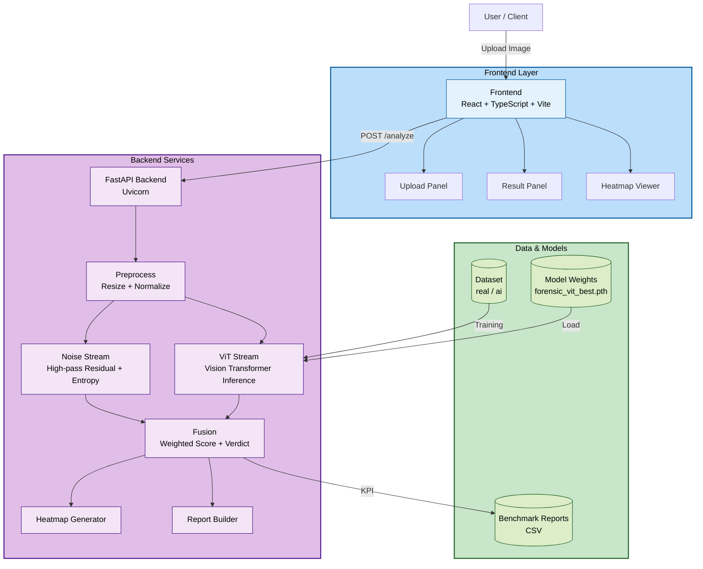

# ForensiCheck

ForensiCheck is a dual-stream digital image forensics web application designed to verify the authenticity of images and detect AI-generated or manipulated content. It combines two complementary analysis streams: a statistical stream that extracts sensor-noise residuals, entropy patterns, and frequency-domain signals from image data, and a neural stream powered by a Vision Transformer (ViT) that estimates the probability that an image was generated by artificial intelligence. The system fuses both streams into a unified authenticity score, provides a clear verdict, generates a detailed forensic report, and produces an explainable heatmap overlay that highlights suspicious regions. This explainability-first approach helps journalists, moderators, OSINT analysts, and fact-checkers understand not just whether an image is authentic, but why the model reached that conclusion. By reducing the spread of misinformation and supporting digital trust, ForensiCheck directly contributes to UN Sustainable Development Goal 16 (Peace, Justice, and Strong Institutions). The application is built as a modern full-stack system with a FastAPI backend handling image ingestion, preprocessing, multi-stream inference, score fusion, and report generation, alongside a React and TypeScript frontend providing an interactive dashboard for uploads, results visualization, and heatmap inspection. The entire stack is containerized with Docker and Docker Compose for consistent deployment across development and production environments, and the backend includes comprehensive scripts for model training, evaluation, benchmarking, and threshold calibration to support continuous improvement of detection accuracy.

## Architecture



## Repository Structure

- `backend/app/main.py`: FastAPI API entrypoint (`/health`, `/analyze`).
- `backend/app/services/noise_stream.py`: high-pass residual and entropy analysis.
- `backend/app/services/vit_stream.py`: ViT inference and confidence map generation.
- `backend/app/services/fusion.py`: weighted score fusion and verdict.
- `backend/app/services/heatmap.py`: forensic heatmap overlay generation.
- `backend/scripts/benchmark_dataset.py`: KPI benchmark script.
- `frontend/src`: React + TypeScript dashboard.

## Local Development

### Backend

```bash
cd backend
pip install -r requirements.txt
uvicorn app.main:app --reload --port 8000
```

Optional model weights:

- Set `FORENSICHECK_VIT_WEIGHTS` to a fine-tuned checkpoint path.
- If unset, the app uses a pre-trained backbone with a two-class head for MVP bootstrapping.

## Train Your Model (Recommended)

Place labeled images in:

- `backend/dataset/real`
- `backend/dataset/ai`

Then train:

```bash
cd backend
python scripts/train_vit.py --data-dir dataset --output models/forensic_vit_best.pth --epochs 6 --batch-size 16
```

Evaluate:

```bash
python scripts/evaluate_vit.py --data-dir dataset --weights models/forensic_vit_best.pth
```

Use in API:

```bash
FORENSICHECK_VIT_WEIGHTS=backend/models/forensic_vit_best.pth
```

Inspect checkpoint class mapping:

```bash
python scripts/inspect_checkpoint.py --weights models/forensic_vit_best.pth
```

If using an old/raw checkpoint without metadata, set class index manually:

```bash
FORENSICHECK_AI_CLASS_INDEX=0
```

### Frontend

```bash
cd frontend
npm install
npm run dev
```

Set API base URL if needed:

```bash
VITE_API_BASE=http://localhost:8000
```

## API Contract

`POST /analyze` (multipart image upload) returns:

- `authenticity_score` (0-100)
- `ai_probability` (0-1)
- `verdict` (`Authentic` or `AI-Generated`)
- `forensic_report`
- `noise_signal`, `ela_signal`, `edge_signal`, `cnn_signal` (explainability signals)
- `heatmap` (base64 PNG overlay)
- `latency_ms`

If no tuned model checkpoint is configured, verdict is returned as `Inconclusive` to avoid misleading confidence.

## KPI Evaluation

1. Place labeled samples in `backend/dataset/real` and `backend/dataset/ai`.
2. Run:

```bash
python backend/scripts/benchmark_dataset.py --api-url http://localhost:8000 --dataset-dir backend/dataset --output backend/reports/benchmark.csv
```

Tracks:

- Detection accuracy target: **>90%**
- Latency target: **<3 seconds** per image
- Explainability target: at least two technical signals in every response

Threshold calibration:

```bash
python backend/scripts/calibrate_thresholds.py --benchmark backend/reports/benchmark.csv
```

Performance tuning env vars:

- `FORENSICHECK_NOISE_WEIGHT` (default `0.35`)
- `FORENSICHECK_VIT_WEIGHT` (default `0.65`)
- `FORENSICHECK_AUTHENTIC_THRESHOLD` (default `50`)

## Deployment

### Docker Compose

```bash
docker compose up --build
```

- Frontend: `http://localhost:5173`
- Backend: `http://localhost:8000`

### Suggested Cloud Split

- Frontend: Vercel (static build).
- Backend: Render/Fly.io/other Python host with model-weight environment config.

## Social Impact (SDG 16)

ForensiCheck supports **UN SDG 16 (Peace, Justice, and Strong Institutions)** by helping journalists, moderators, and OSINT analysts detect digital forgery and reduce misinformation harm.
